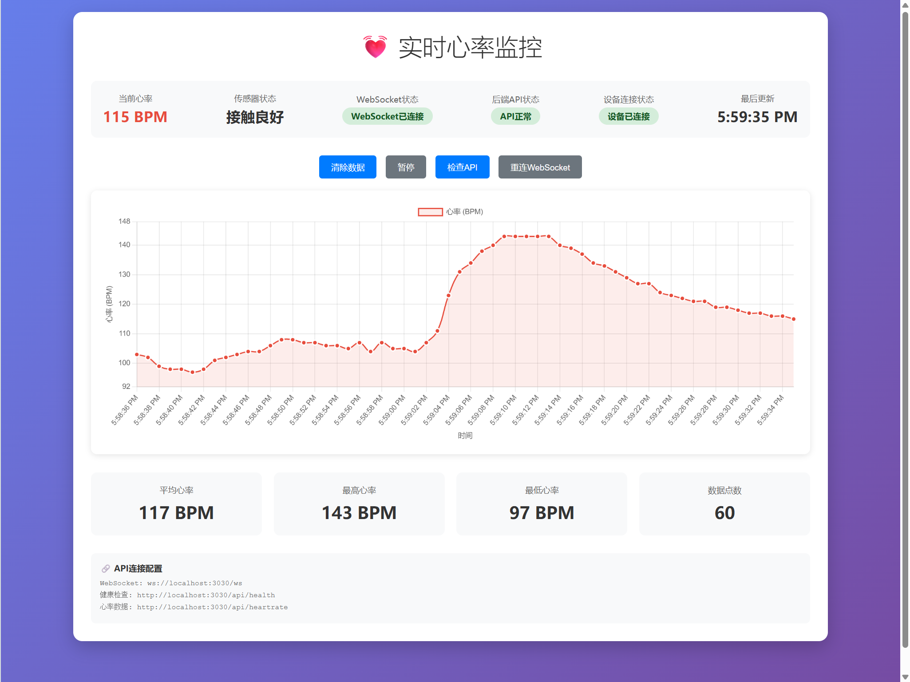

# 🫀 小米手环实时心率监控 - Web版

这是一个基于Rust的小米手环心率监控程序，通过Web浏览器实时显示心率图表。

## ✨ 功能特性

- 🔄 **实时监控**: 通过蓝牙连接小米手环，实时获取心率数据
- 📊 **动态图表**: 使用Chart.js绘制实时心率曲线图
- 🌐 **Web界面**: 通过浏览器访问，支持多设备查看
- 📱 **响应式设计**: 适配桌面和移动设备
- 📈 **统计信息**: 显示平均、最高、最低心率和数据点数量
- ⏸️ **暂停/恢复**: 支持暂停数据更新和清除历史数据
- 🔗 **WebSocket**: 实时数据推送，低延迟显示
- 🔁 **自动重连**: 智能重连机制，设备断开后自动重新连接

## 🚀 快速开始

### 1. 准备工作

确保您的系统满足以下条件：

- 安装了Rust（推荐使用rustup） https://rustup.rs/
- 支持蓝牙模块
- 小米手环（支持心率监测）

### 2. 编译运行

```bash
# 克隆项目（如果需要）
git clone <repository-url>
cd miband-heart-rate-web

# 编译项目
cargo build --release

# 运行程序
cargo run
```

### 3. 连接设备

1. 小米手表：设置-心率广播-开启
2. 运行程序后，它会自动扫描并连接心率设备
3. 看到"开始接收心率数据..."提示后，表示连接成功

### 4. 查看Web界面

1. Vscode使用静态服务代理插件Live Server或者nginx
2. 访问index.html
3. 即可看到实时心率监控界面

## 🎯 界面说明


### 主要功能区域

- **状态栏**: 显示当前心率、传感器状态、连接状态和最后更新时间
- **控制按钮**:
  - "清除数据": 清空图表中的所有历史数据
  - "暂停/恢复": 暂停或恢复数据更新
- **实时图表**: 显示最近50个心率数据点的动态曲线
- **统计信息**: 显示平均心率、最高心率、最低心率和数据点数量

### 颜色说明

- 🟢 **绿色**: 连接正常
- 🔴 **红色**: 连接断开或异常
- 💙 **蓝色**: 心率数据曲线

## 🔧 技术架构

### 后端技术栈

- **Rust**: 主要编程语言
- **Tokio**: 异步运行时
- **Bluest**: 蓝牙通信库
- **Warp**: Web服务器框架
- **WebSocket**: 实时数据推送

### 前端技术栈

- **HTML5/CSS3**: 界面结构和样式
- **JavaScript**: 交互逻辑
- **Chart.js**: 图表绘制库
- **WebSocket API**: 实时数据接收

### 数据流程

```
小米手环 → 蓝牙 → Rust程序 → WebSocket → 浏览器 → Chart.js
```

### 🔍 设备状态检测机制

本项目采用多层次的设备状态检测机制，确保连接的稳定性和可靠性：

#### 1. 蓝牙连接状态检测

- 使用 `device.is_connected().await` 直接检测设备的蓝牙连接状态
- 在处理设备前会自动检查并建立连接

#### 2. 数据接收状态检测

- 通过心率数据的接收情况判断设备状态
- 能接收到数据说明设备连接正常，`device_connected` 字段会设置为 `true`

#### 3. 超时检测机制

- 系统会监控最后一次数据更新的时间
- **关键参数**: 如果超过 **10秒** 没有收到新的心率数据，自动判断设备断开连接
- 超时后会发送断开连接状态信息，心率显示为0

### 🔄 掉线重连机制

项目实现了三层自动重连机制：

#### 1. 最外层循环重连

- 蓝牙监控运行在无限循环中
- 任何错误发生时，等待 **5秒** 后自动重试
- 发送设备断开状态通知到Web界面

#### 2. 设备搜索和连接重连

- 首先检查是否有已连接的心率设备
- 如果没有，启动设备扫描寻找新设备
- 处理设备连接失败时，等待 **5秒** 后重试

#### 3. 实时状态监控

- Web服务器每秒检查设备状态
- 通过WebSocket实时向前端发送设备连接状态
- 确保用户界面始终显示准确的连接状态

#### 重连时间参数

- **蓝牙连接失败重试间隔**: 5秒
- **设备处理错误重试间隔**: 5秒
- **数据超时检测阈值**: 10秒
- **状态广播频率**: 1秒

## 📊 数据格式

心率数据以JSON格式通过WebSocket传输：

```json
{
  "timestamp": "2024-01-01 12:00:00",
  "heart_rate": 75,
  "sensor_contact": true,
  "device_connected": true
}
```

### 字段说明

- `timestamp`: 时间戳（格式：YYYY-MM-DD HH:MM:SS）
- `heart_rate`: 心率值（BPM），断开连接时为0
- `sensor_contact`: 传感器接触状态
  - `true`: 传感器接触良好
  - `false`: 传感器接触不良
  - `null`: 设备不支持接触检测或状态未知
- `device_connected`: 设备连接状态（新增字段）
  - `true`: 设备已连接并正常工作
  - `false`: 设备断开连接或连接异常

### 数据状态示例

#### 正常连接状态

```json
{
  "timestamp": "2024-01-01 12:00:00",
  "heart_rate": 75,
  "sensor_contact": true,
  "device_connected": true
}
```

#### 设备断开状态

```json
{
  "timestamp": "2024-01-01 12:00:30",
  "heart_rate": 0,
  "sensor_contact": null,
  "device_connected": false
}
```

## 🛠️ 自定义配置

### 修改端口

在 `src/web_server.rs` 文件中修改：

```rust
warp::serve(routes)
    .run(([127, 0, 0, 1], 3030))  // 修改3030为其他端口
    .await;
```

### 调整数据点数量

在 `static/index.html` 中修改：

```javascript
let maxDataPoints = 50; // 修改为其他数值
```

### 修改连接检测参数

在 `src/web_server.rs` 中修改超时检测阈值：

```rust
if elapsed > Duration::from_secs(10) {  // 修改10为其他秒数
    // 数据过时，标记设备为断开连接状态
    buffer_guard.device_connected = false;
}
```

### 修改重连间隔

在 `src/main.rs` 中修改重连等待时间：

```rust
println!("5秒后重试蓝牙连接...");
tokio::time::sleep(tokio::time::Duration::from_secs(5)).await;  // 修改5为其他秒数
```

### 修改状态广播频率

在 `src/web_server.rs` 中修改广播间隔：

```rust
let mut interval_timer = interval(Duration::from_secs(1));  // 修改1为其他秒数
```

### 修改图表样式

在 `static/index.html` 的Chart.js配置中调整颜色、样式等。

## 📝 开发说明

### 项目结构

```
src/
├── main.rs          # 主程序入口
├── web_server.rs    # Web服务器实现
static/
└── index.html       # Web界面
```

## 📄 许可证

本项目基于MIT许可证开源。

## 🤝 贡献

欢迎提交Issue和Pull Request！

---

**注意**: 此程序仅用于学习和研究目的，不能替代专业医疗设备。如有健康问题，请咨询专业医生。
